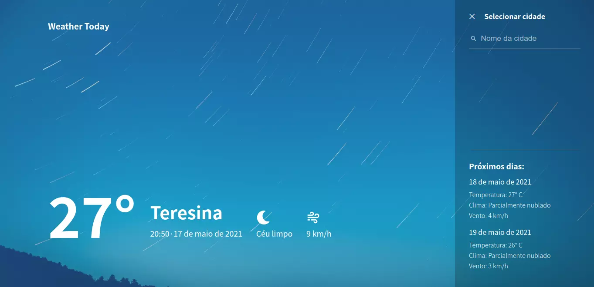

# Weather Today

Web app simples para visualizar informações do clima 🌡️.

Acessar a demonstração: https://weather-today.vercel.app

<p align="center">
  
</p>

## ✨ Tecnologias

- HTML5/CSS3
- Sass
- ReactJS

## 🚀 Como executar

Clone o projeto e acesse a pasta do mesmo.

```bash
$ git clone https://github.com/wellysonvie/weather-today.git
$ cd weather-today
```

Para iniciá-lo, siga os passos abaixo:
```bash
# Instalar as dependências
$ yarn

# Iniciar o projeto
$ yarn start
```

Agora você pode acessar [`http://localhost:3000`](http://localhost:3000) no navegador.

## 🔖 Layout

A interface do projeto foi inspirada no seguinte layout:

https://dribbble.com/shots/7767460-Weather-App-Website
